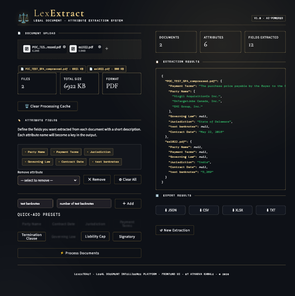
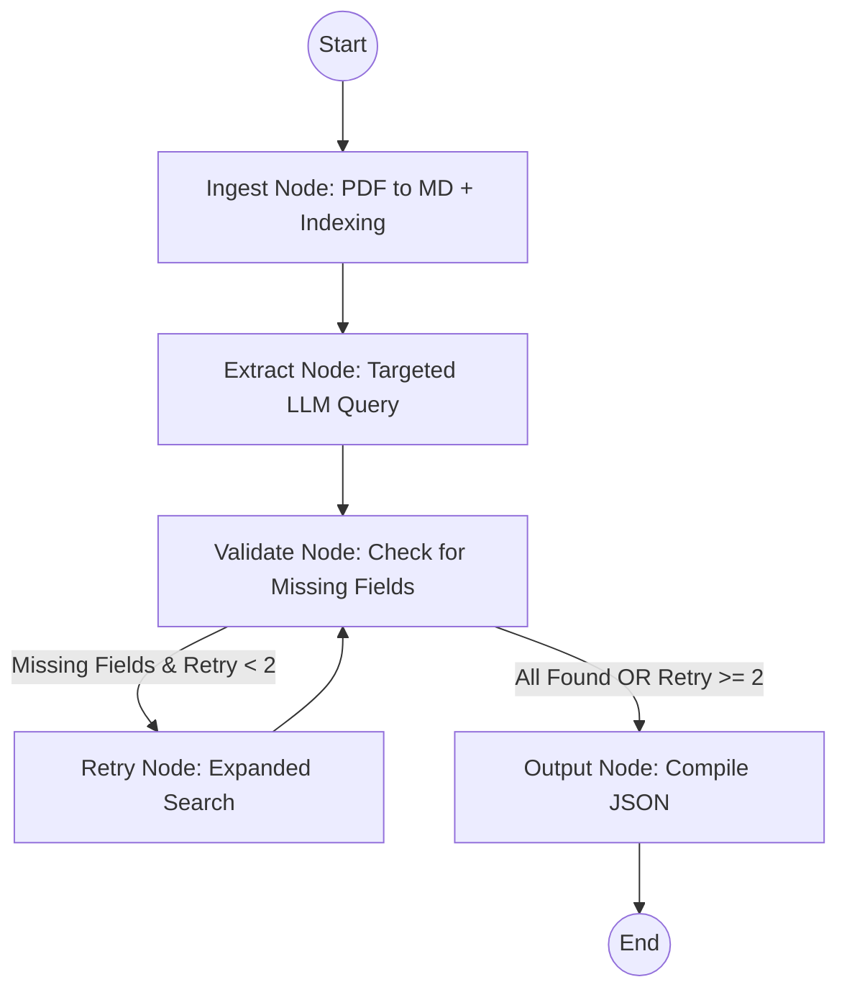

# LexExtract - Targeted Document Extraction

<p align="center">
  
</p>

This repository contains a Proof of Concept (PoC) for high-precision information extraction from PDF documents, specifically tailored for **Share Purchase Agreements (SPAs)**. It leverages **LangGraph** for workflow orchestration, ensuring a robust self-correction loop and optimized retrieval.

## 🚀 Key Features

- **State-of-the-Art PDF Processing**: Uses `pymupdf4llm` to convert complex PDFs into clean Markdown for better LLM consumption.
- **Agentic Workflow**: Managed by LangGraph, featuring automated validation and retry logic.
- **Context-Aware Retrieval**: 
    - **Preamble Injection**: Automatically prepends the first 1500 characters of the document (the context-rich header/preamble) to every target query.
    - **Targeted Search**: Uses semantic chunking and Qdrant vector search to find specific fields.
- **Self-Correction Loop**: Validates extracted data and automatically retries missing or low-confidence fields (up to 2 retry attempts).
- **Parallel Extraction**: Supports sequential or parallel field extraction (configurable via environment variables).

## 🏗 Architecture



## 🛠 Setup

### Prerequisites
- Python 3.12
- **Ollama** (running locally with the required model)
- **Qdrant** (local storage is handled automatically)

### Installation
1. Clone the repository.
2. Install dependencies:
   ```bash
   pip install -r requirements.txt
   ```
3. Create a `.env` file from `.env.example`:
   ```bash
   cp .env.example .env
   ```

### Configuration
Update the `.env` file with your specific settings:
- `OLLAMA_MODEL`: The model name (e.g., `gemma4:e2b`).
- `OLLAMA_BASE_URL`: URL for your Ollama instance.
- `PDF_PATH`: Path to the target PDF in the `input/` folder.
- `EXTRACTION_MODE`: Set to `parallel` or `sequential`.

## 📖 Usage

### Web Interface (Recommended)
Launch the interactive dashboard to upload documents and define extraction attributes:
```bash
python main.py
```

### CLI Workflow
For automated batch processing or testing without the UI:
1. Place your target PDF in the `input/` directory.
2. Update the `PDF_PATH` in `.env`.
3. Run the CLI runner:
   ```bash
   python src/cli_runner.py
   ```
The final extracted data will be saved to `output.json`.

## 📁 Project Structure

- `main.py`: Interactive entry point (launches Streamlit UI).
- `src/cli_runner.py`: CLI-based extraction workflow runner.
- `src/nodes.py`: Implementation of LangGraph nodes (Ingest, Extract, Validate, Retry).
- `src/graph.py`: Definition of the StateGraph and routing logic.
- `src/schema.py`: Pydantic models defining the extraction target (SharePurchaseAgreement).
- `src/utils/`: Helper utilities for PDF processing, chat models, and document indexing.
- `input/`: Directory for source PDF documents.
- `frontend/`: Streamlit web application files.

---
*Built for specialized legal document extraction workflows.*
