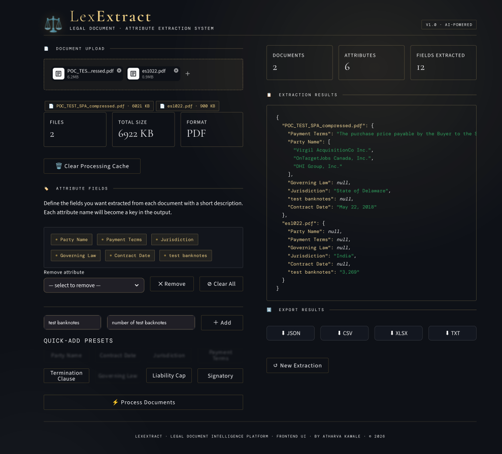
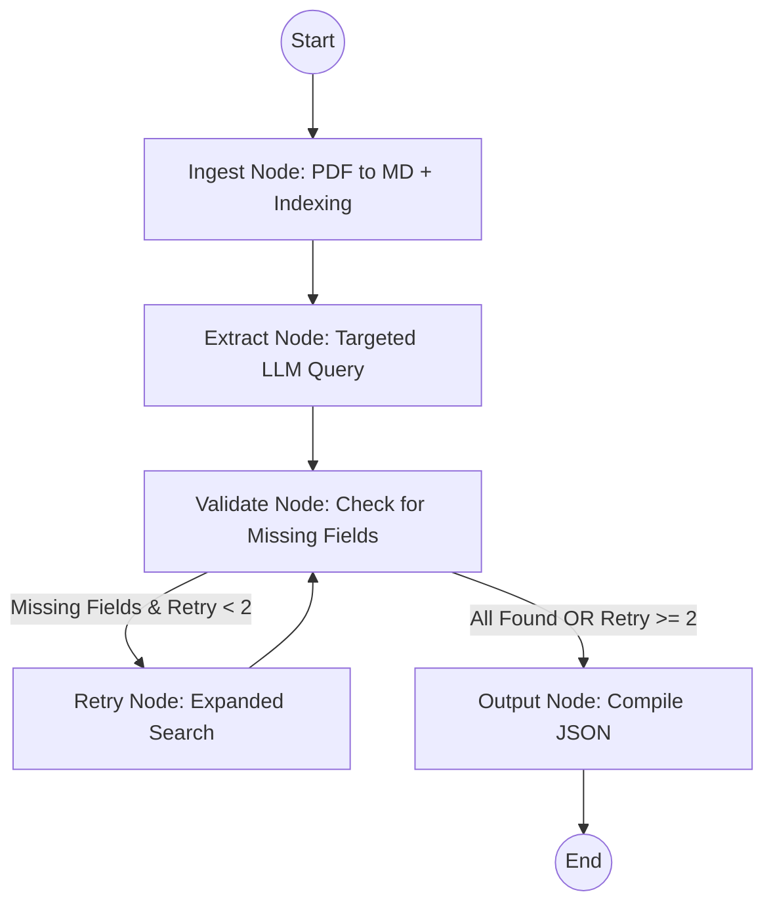

# LexExtract - Targeted Document Extraction

<p align="center">
  
</p>

LexExtract is a high-precision document extraction engine designed to turn unstructured legal PDFs into structured, actionable data. Unlike simple RAG systems, LexExtract uses an **agentic loop** to self-correct and verify its own findings, ensuring enterprise-grade accuracy.

## 🚀 Key Features

- **Multi-Document Processing**: Batch upload and process multiple PDFs simultaneously. Each document is indexed and extracted in isolation to prevent data leakage.
- **Enterprise-Grade Accuracy**: 
    - **Self-Correction Loop**: Validates extraction results against expected schemas and automatically triggers "deep search" retries for missing or ambiguous data.
    - **Preamble Injection**: Automatically identifies and injects the document header (where the most critical context like dates and parties usually reside) into every target query.
- **State-of-the-Art PDF Parsing**: Leverages `pymupdf4llm` to transform complex PDF layouts into clean LLM-ready Markdown, preserving tables and structure.
- **Smart Vector Isolation**: Uses Qdrant with specific metadata filtering to ensure that queries for Document A never retrieve context from Document B.
- **Flexible Model Backend**: Switch seamlessly between local models (Ollama) and cloud providers (OpenAI, Anthropic) without changing code.
- **Parallel Execution**: Optimized for speed with a configurable parallel extraction mode.

## 🏗 Architecture



## 🛠 Setup

### Prerequisites
- Python 3.12
- **Ollama** (running locally with the required model)
- **Qdrant** (local storage is handled automatically)

### Installation
1. Clone the repository.
2. Install dependencies:
   ```bash
   pip install -r requirements.txt
   ```
3. Create a `.env` file from `.env.example`:
   ```bash
   cp .env.example .env
   ```

### Configuration

Create a `.env` file in the root directory and configure the following variables. You can find a template in `.env.example`.

#### 1. Choose a Model Provider
The application uses LangChain's `init_chat_model` and supports multiple LLM backends:

| Provider | `MODEL_PROVIDER` | `MODEL_NAME` (Example) | Required Key |
| :--- | :--- | :--- | :--- |
| **Ollama** (Local) | `ollama` | `gemma2:9b` | N/A (Local) |
| **OpenAI** | `openai` | `gpt-4o` | `OPENAI_API_KEY` |
| **Anthropic** | `anthropic` | `claude-3-5-sonnet-20240620` | `ANTHROPIC_API_KEY` |

#### 2. Environment Variables
- `MODEL_PROVIDER`: The backend provider (see table above).
- `MODEL_NAME`: The specific model version you wish to use.
- `OLLAMA_BASE_URL`: (Only for Ollama) Usually `http://localhost:11434`.
- `OPENAI_API_KEY` / `ANTHROPIC_API_KEY`: Your respective API keys.
- `PDF_PATH`: The default file path for the CLI runner.
- `EXTRACTION_MODE`: Set to `parallel` (faster) or `sequential` (lower resource usage).

#### 3. Optional: LangSmith (Tracing)
To enable debugging and tracing of your extraction chains:
- `LANGCHAIN_TRACING_V2`: Set to `true`.
- `LANGCHAIN_API_KEY`: Your LangSmith API key.

## 📖 Usage

### Web Interface (Recommended)
Launch the interactive dashboard to upload documents and define extraction attributes:
```bash
python main.py
```

### CLI Workflow
For automated batch processing or testing without the UI:
1. Place your target PDF in the `input/` directory.
2. Update the `PDF_PATH` in `.env`.
3. Run the CLI runner:
   ```bash
   python src/cli_runner.py
   ```
The final extracted data will be saved to `output.json`.

## 📁 Project Structure

- `main.py`: Interactive entry point (launches Streamlit UI).
- `src/cli_runner.py`: CLI-based extraction workflow runner.
- `src/nodes.py`: Implementation of LangGraph nodes (Ingest, Extract, Validate, Retry).
- `src/graph.py`: Definition of the StateGraph and routing logic.
- `src/schema.py`: Pydantic models defining the extraction target (SharePurchaseAgreement).
- `src/utils/`: Helper utilities for PDF processing, chat models, and document indexing.
- `input/`: Directory for source PDF documents.
- `frontend/`: Streamlit web application files.

## 📜 License

This project is licensed under the **Apache License 2.0**. See the [LICENSE](LICENSE) file for details.

---
*Built for specialized legal document extraction workflows.*
